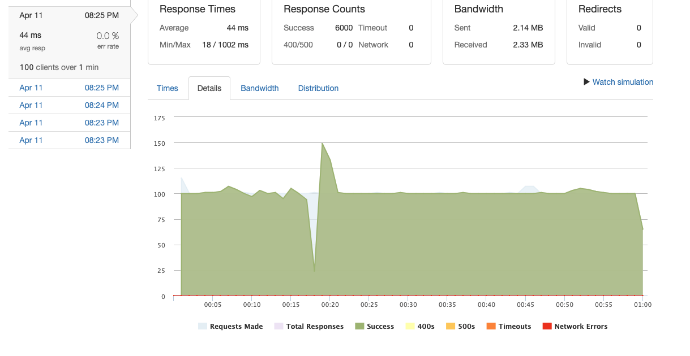

# Team Thyme Questions and Answers API Documentation

The goal of this project was to deploy a working backend system with both server and database for a legacy product landing page's Q&A section. Because the data in this section only had "one to many" relationships (i.e. one product to many questions, one question to many answers,) MySQL was chosen as the database to best fit the needs of the project.

The data itself came in three large csv files (questions, answers, and answer_photos), each containing millions of records. Luckily, the format of the initial data was such that it could be directly verified and loaded into the database. MySQL's native and custom table constraints were use to check the validity of the data as it was being loaded into the database.

Docker was later implemented for easier deployment to AWS.

### Technologies Used

> Back-End

- Node.js
- Express
- MySQL
- Docker

> Stress Testing
- Loader.io

 Request Type | Endpoint                          | Returns
  ------------ | --------------------------------- | ---------------------------------------------------------------------------------------------------------------------
  GET          | /qa/questions                    | Returns an object with questions for a particular product along with answers/photos associated with the question. "product_id" is a mandatory query parameter, "page" and "count" are optional query paramters that default to 1 and 5 respectively.
   GET          | /qa/questions/:questionId/answers           | Returns object with answers and photos related a question. Accepts "page" and "count" as optional query paramters that default to 1 and 5 respectively.
   POST         | /qa/questions                   | Posts a question for a specfic product. Requires a "product_id" query paramter to specify which product the question is in regards to. The request body is accepted as JSON data.
   POST         | /qa/questions/:questionId/answers     | Posts an answer and up to 5 photos for a question. The request body is accepted as JSON data.
    PUT          | /qa/questions/:question_id/helpful | Increments the "helpful" statistic associated with a question.
    PUT | /qa/questions/:question_id/report | Toggles a question as being "reported".
    PUT | /qa/answers/:answer_id/helpful | Increments the "helpful" statistic associated with an answer.
    PUT | /qa/answers/:answer_id/report | Toggles an answer as being "reported".

## Stress Test Results

I tested the system using Loader.io to generate a number of clients per second. The uses MySQL only, and leaves the door open for future optomizations such as caching via Redis. The system is designed to optomize read speeds at the cost of write speeds, with each table having both a primary key index, and an index by foreign key.

The 'GET' request tests for both the questions and the answers showed that the system capped out at around 400 clients per second which, at 300 requests over the inital goal, is reasonably resilient and provides a good foundation for future updates and improvements.

> Note that the low number for '400' errors is due to the incompleteness of the data in the deployed instance, rather than a fault with the system.

The 'POST' request tests showed less resilience in the system for write operations, as expected. The server could write about 250 questions per second, and write between 100 and 250 answers per second depending on whether or not the answers did or didn't have attached photos. It's important to note that each answer's attached photos had to be saved in a separate table and thus rewrite a second index. Since not every answer would have attached photos in a real world scenario, the 100 number is more of a worst case test than an average one. Never the less, these operations definitely have room for improvement, and more research will need to be done in what improvements can be made while preserving the read speeds of the system.

> answers with photos

> answers without photos

